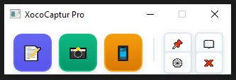
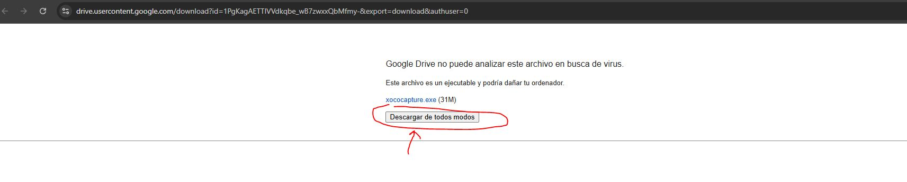

# ✨ XocoCaptur Pro ✨

¡Tu herramienta de captura y reconocimiento de texto, ultra-ligera y potente!

XocoCaptur Pro es una aplicación de escritorio minimalista diseñada para hacerte la vida más fácil. Captura cualquier parte de tu pantalla, extrae texto de imágenes al instante o lee códigos QR con un solo clic.

)

---

## 🚀 Funcionalidades Principales

*   **✍️ Reconocimiento de Texto (OCR):** Captura cualquier texto en tu pantalla (un error, un documento, un tuit) y conviértelo a texto plano que puedes copiar y pegar.
*   **📸 Captura de Pantalla Avanzada:** No es una simple captura. Edita tus imágenes al momento:
    *   **Dibuja** sobre ellas para señalar lo importante.
    *   **Gira** la imagen si la necesitas en otra orientación.
    *   **Haz zoom** para ver los detalles.
*   **📱 Lector de Códigos QR:** Captura cualquier código QR en pantalla y obtén el texto o enlace que contiene al instante.
*   **📖 Historial de Capturas:** Guarda automáticamente todas tus capturas de texto para que puedas consultarlas más tarde.
*   **⚙️ Configurable y Sencillo:** Una interfaz minimalista que no molesta y opciones claras para que todo funcione a la primera.
*   **📌 Siempre Visible:** ¿Necesitas tener la herramienta a mano? Fíjala encima de todas las demás ventanas con un solo clic.

---

## 📦 Instalación y Primeros Pasos

Para que XocoCaptur Pro funcione al 100%, solo necesitas dos cosas: la aplicación y una herramienta externa gratuita llamada Tesseract.

### 1. Descargar XocoCaptur Pro

Ve a la sección de **[Releases]([URL_DE_TU_SECCION_DE_RELEASES_AQUI](https://drive.google.com/file/d/1fqKCb5BV8cesei2e2sIU-ASexF6K1K47/view?usp=sharing))** en este repositorio y descarga la última versión de `XocoCaptur.exe`.

> **Nota:** Al ser un ejecutable no firmado, es posible que Windows muestre una advertencia de seguridad. Simplemente haz clic en "Más información" y luego en "Ejecutar de todas formas".

### 2. Instalar Tesseract OCR (¡Paso Obligatorio para el Texto!)

El reconocimiento de texto (OCR) depende de Tesseract, un motor de reconocimiento de texto de código abierto de Google.

1.  **Descarga el instalador** para Windows desde la [página oficial de Tesseract en UB-Mannheim](https://github.com/UB-Mannheim/tesseract/wiki).
2.  **Ejecuta el instalador.** Durante la instalación, es muy recomendable que marques la casilla para **añadir los idiomas que necesites** (por ejemplo, "Spanish").
3.  **Apunta la ruta donde se instaló.** Generalmente es `C:\Program Files\Tesseract-OCR\`.

---

## 🛠️ Guía de Uso

La interfaz es súper simple y está diseñada para ser intuitiva.

### La Ventana Principal

*   **📝 Captura OCR:** Inicia una captura para reconocer texto.
*   **📸 Captura de Pantalla:** Inicia una captura para obtener una imagen.
*   **📱 Código QR:** Inicia una captura para leer un código QR.

*   **📌 Siempre Visible:** Fija la ventana por encima de todo.
*   **📖 Historial:** Abre el historial de tus capturas de texto.
*   **⚙️ Configuración:** Abre los ajustes (¡importante para el primer uso!).
*   **❌ Minimizar:** Oculta la aplicación en la bandeja del sistema (al lado del reloj).

### Primer Uso: Configurar Tesseract

1.  Abre XocoCaptur Pro.
2.  Haz clic en el botón de **Configuración** (⚙️).
3.  En la ventana que aparece, haz clic en el botón **"Buscar..."** o **"Browse..."**.
4.  Navega hasta la carpeta donde instalaste Tesseract (ej. `C:\Program Files\Tesseract-OCR\`) y selecciona el archivo `tesseract.exe`.
5.  Haz clic en **"Guardar y Cerrar"**.

¡Listo! La función de reconocimiento de texto ya está activada para siempre.

### Realizar una Captura

1.  Haz clic en el botón de la acción que quieras (OCR, Captura o QR).
2.  La pantalla se oscurecerá ligeramente.
3.  Haz clic y **arrastra el ratón** para dibujar un rectángulo sobre el área que quieres capturar.
4.  ¡Suelta el clic y listo! Se abrirá la ventana con el resultado.

---

## Instalación y Ejecución
 Descarga el ejecutable desde el siguiente enlace:
   [Descargar Clipboard Manager](https://drive.google.com/file/d/1fqKCb5BV8cesei2e2sIU-ASexF6K1K47/view?usp=sharing)
   

## Capturas de pantalla instalación

## Contribuciones
Las contribuciones son bienvenidas. Realiza un fork del repositorio y envía tus pull requests.

---

_Disfruta de Clipboard Manager y facilita tu flujo de trabajo con un portapapeles mejorado!_

## Descargo de Responsabilidad

**Importante:** El uso de este código es bajo total responsabilidad del usuario. ** Xocostudio** no se hace responsable por ningún tipo de mal uso, daño directo o indirecto, pérdida de datos, o cualquier otro perjuicio que pueda derivarse del uso de este software.

### Sin Garantías

El software se proporciona "tal cual", sin garantías de ningún tipo, ya sean expresas o implícitas. Esto incluye, pero no se limita a, las garantías de comerciabilidad, adecuación para un propósito particular y no infracción.

### Exención de Responsabilidad

Los autores no son responsables por cualquier reclamación, daño u otra responsabilidad que surja del uso del software, ya sea en una acción de contrato, agravio o de otra manera, que surja de, fuera de o en conexión con el software o el uso u otros tratos en el software.

### Uso del Código

Al descargar y utilizar este código, aceptas hacerlo bajo tu propio riesgo. Es tu responsabilidad asegurarte de que el software es adecuado para tus necesidades y de tomar todas las precauciones necesarias para evitar posibles daños o pérdidas.

Si tienes alguna pregunta o necesitas más información, por favor contacta a Xocostudio.

---

## Descargo de Responsabilidad

**Importante:** El uso de este código es bajo total responsabilidad del usuario. ** Xocostudio** no se hace responsable por ningún tipo de mal uso, daño directo o indirecto, pérdida de datos, o cualquier otro perjuicio que pueda derivarse del uso de este software.

### Sin Garantías

El software se proporciona "tal cual", sin garantías de ningún tipo, ya sean expresas o implícitas. Esto incluye, pero no se limita a, las garantías de comerciabilidad, adecuación para un propósito particular y no infracción.

### Exención de Responsabilidad

Los autores no son responsables por cualquier reclamación, daño u otra responsabilidad que surja del uso del software, ya sea en una acción de contrato, agravio o de otra manera, que surja de, fuera de o en conexión con el software o el uso u otros tratos en el software.

### Uso del Código

Al descargar y utilizar este código, aceptas hacerlo bajo tu propio riesgo. Es tu responsabilidad asegurarte de que el software es adecuado para tus necesidades y de tomar todas las precauciones necesarias para evitar posibles daños o pérdidas.

Si tienes alguna pregunta o necesitas más información, por favor contacta a Xocostudio.

---

*¡Gracias por utilizar nuestro software! Asegúrate de leer y entender este descargo de responsabilidad antes de proceder.*

